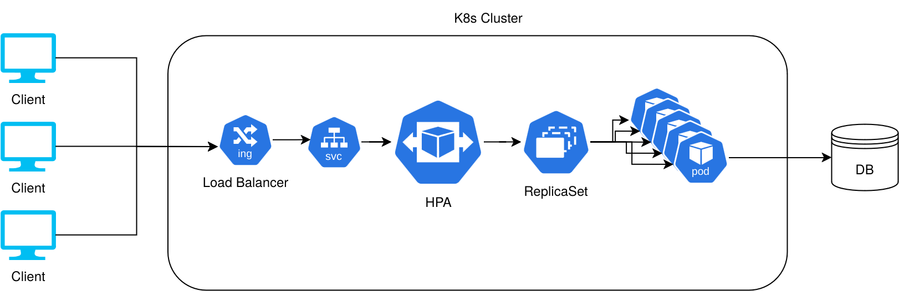

# Stability Notes

Started: 26/08/2024 00:50
Paused: 26/08/2024 04:15
Duration: 3 hr 25 min

Started: 26/08/2024 11:00
Paused: 26/08/2024 12:45
Duration: 1 hr 45 min

Started: 26/08/2024 13:45
Completed: 26/08/2024 15:20
Duration: 1 hr 35 min

Total Time: 6 hr, 45 min

## Initial Thoughts

The scope of the requirements has increased and there is a need to scale up.
The current bare metal DigitalOcean bucket and resources are not enough to
handle the requirements easily.
As a result we are moving to a cloud provider.
Originally, this would have been Heroku, but since Heroku no longer has a
free tier, we will be using fly.io.

### Deployment to Fly.io

1. Install the fly CLI
2. Run `fly launch` in the root directory.
3. Fly.io handles the deployment. It took about 5 minutes.

## Seeding Data

ChatGPT ran out of analysis tokens.

Seeding data using Rails Console.
Using the Fly.io CLI, we can run `fly console -a menu-grpahql --command="bin/rails c"`

```ruby
ActiveRecord::Base.transaction do
   menu = Menu.create(
      identifier: "menu-002",
      label: "Awesome Menu",
      state: "active",
      start_date: 1.year.ago,
      end_date: Time.now.utc + 1.year
   )

   sections = 6.times.map do |index|
      section = Section.create(
         identifier: "section-#{index}",
         label: "Section Number #{index}",
         description: "This is section number #{index} of the menu called #{menu.label}"
      )
      menu.menu_sections.create(section: section)
      section
   end

   sections.map do |section|
      products = 10.times.map do |product_index|
         product = Item.create(
            type: "Product",
            identifier: "product-#{product_index}-#{section.identifier}",
            label: "Product called #{product_index}-#{section.identifier}",
            description: "This describes a product in #{section.label}.",
            price: rand(0..500.0).round(2)
         )
         section.section_items.create(item: product, display_order: product_index)

         next if product_index >= 5

         modifier_groups = 2.times do |mod_group_index|
            modifier_group = ModifierGroup.create(
               identifier: "mod-group-#{mod_group_index}-#{product.identifier}",
               label: "Modifier Group #{mod_group_index}-#{product.identifier}",
               selection_required_min: rand(0..10),
               selection_required_max: rand(11..100)
            )
            product.item_modifier_groups.create(
               modifier_group: modifier_group
            )

            3.times do |comp_index|
               component = Item.create(
                  type: "Component",
                  identifier: "component-#{comp_index}-#{modifier_group.identifier}",
                  label: "Component called #{comp_index}-#{modifier_group.identifier}",
                  description: "This is a component of a modifier group: #{modifier_group.identifier}",
                  price: rand(0..50.0).round(2)
               )
               modifier_group.modifiers.create(item: component,
                  display_order: mod_group_index,
                  default_quantity: rand(5..100),
                  price_override: rand(0.1..10.0).round(2)
               )
            end
         end
      end
   end
end
```

## Logging

Without proper logging we will not be able to figure out what is slow
or how to improve performance.

Fly.io provides a logging using the `fly logs` command.

Fly.io also provides the application logs in Grafana.

Screenshots:


## Metrics

Fly.io also provides in-built metrics using Prometheus.
We just need to add GaaphQL specific metrics in.

GraphQL Ruby gem already provides a metrics exported that
is compatible with the `prometheus_exporter` gem.
So we will use both of these together.

Additional configuration is required to ensure that the metrics
pushed by GraphQL exporter can reach the metrics collector.
We need to use `metrics.process.menu-graphql.internal` to route using Fly.io's
internal DNS routing.

After much work, both the GraphQL prometheus traces and the prometheus exporter
were able to communicate with each other. However, Fly.io still did not show
any of the `ruby_...` metrics that were expected.
I could not find any information on how to resolve this online or on
ChatGPT.
As a result, this had to be left unresolved, as opening a support ticket
with Fly.io would have taken quite long and it was crunch time.

## Query Performance

In order to analyze query performance, we need to add logging to it.
There are also default metrics available in Fly.io for PostgreSQL.

The best way to see N+1 queries in Rails is to just log the queries and see
what shows up. This can be done in development first, before pushing to
production if there really is a need for it.

A first glance at the logs for the following query reveals it is running
all queries in the N+1 mode.

```graphql
query All {
  menus {
    id
    identifier
    label
    state
    startDate
    endDate
    sections {
      id
      identifier
      label
      items {
        id
        identifier
        label
        price
        type
        itemModifierGroups {
          id
          modifierGroup {
            id
            identifier
            modifiers {
              id
              item {
                id
              }
            }
          }
        }
      }
    }
  }
}
```

We will add several `includes` to try to alleviate this.

Shopify has the `graphql-batch` gem which looks like it would work well
for our use-case.

After setting up the `AssociationLoader` and `RecordLoader` for the different
associations, we were able to move the needle on loading that one query
from > 350ms to ~60ms (with a cold DB cache) and ~10ms (with a hot db cache)
locally.
In this case, there is no Rails caching involved.

On production, query times before load were also in a similar ~350ms range.
After deploying the change, the initial load still took ~350ms.
However subsequent loads, after the database cache warmed up, took around
100ms each.
This difference between production and local is likely due to network latency
as local development runs all on the same machine with no network.
Also the local development machine is much more powerful than the machines
provisioned in Fly.io.

## Caching

Reference: [Rails 7.1 makes ActiveRecord query cache an LRU](https://www.shakacode.com/blog/rails-make-active-records-query-cache-an-lru/)

Rails has the ActiveRecord QueryCache on by default which means that
our queries were already being cached. This means part of the performance
improvements seen previously are likely a combination of removing N+1
and the query cache.

The other caching strategy added is to cache the specific GraphQL query
fragments. We will use the `graphql-fragment_cache` gem and just cache
every query that hits the main query entrypoints.
With the fragment caching, all warmed up queries now take > 0ms.

## Load Testing

Asking ChatGPT to generate sample queries for load testing resulted in
it hallucinating about all sorts of NetBIOS and other nonsense.

I will have to manually generate the load test scripts.

The load test script is [./load_test.rb](./load_test.rb).
It runs 50 concurrent threads/processes using the `parallel` gem.
Each of those runs 100 requests sequentially.

Without having deployed the changes for caching, one run of the load test
suite took 89.77 seconds.

After deploying caching, the test suite took 24.09 seconds.

In order for any load test to produce reasonable results and data to
draw conculsions from, there needs to be a target load.

Assuming a restaurant has about 100 tables, and each table hosts a group
of 4 persons, then this test of 5000 requests is well above the expected
maximum concurrent load of 400 requests for a menu.

So for the hypothetical expected load, the current setup of
2 machines with 1CPU each, and 1GB of memory works well enough.
Usually the bottlenecks in a web application is the database.
With caching we've eliminated at least one network round-trip to query data
and the compute cost of generating the result on the database.
This leaves a database with much lower load while still giving guests a good
user experience.

### Where this doesn't scale

If we decide we want to have a food delivery app and open it up to pretty much
the entire country, then we would need to re-think this approach.
Based on expected load, we would tweak the load test scripts and re-run them.
Then use those results to inform our decision making on how to improve
performance.

## Architecture for scaling

When it comes to quickly scaling up and down automatically, Kuberenetes is one
of the best options available.
However, it is not a one-size-fits all solution. In this exercise, I assume
that there are more than one services running within the organization.
As such using Kubernetes as the base for scaling one or all the services in the
organization makes sense. With more services, there is less likely to be excess
capacity as the assumption is the more services, the more consistent the overall
load on the system is likely to be (this does not always hold true).

When there isn't actually more than one service, then the solution to scaling
becomes scale on whichever system you currently use.
For example in Fly.io, I would just increase the number of machines in much the
same way one would do on Heroku.
There is no need to rush off to use Kubernetes.
Maintaining the same architecture as you currently have while scaling up on it
removes any overhead required to re-learn a stack or deployment strategy.
This leaves time and space for actually building features that customers want,
without which there won't be a need to move to Kubernetes in the first place.

A system really starts to need to move to a different deployment strategy
when the current strategy starts to cost multiple times more than what it
would cost to run the new stack. This is to make up for loss in developer
productivity during the move and after it.
An example would be if your cloud hosting costs are more than the cost
of paying a full-time devops person and the compute of a Kubernetes cluster,
then it makes sense to move to Kubernetes.



In this case, Kubernetes handles load balancing, scaling, and availability
automatically. Assuming there is enough actual compute capacity.

Some pros for Kubernetes:

- It is becoming industry standard, so it is easy to hire people to manage it.
- There is a lot of community support.
- Many tools available today integrate well, or are kubernetes native.

Some cons of Kubernetes:

- Setting up and managing the cluster is a full-time job.
- The learning curve is steep.
- It isn't opinionated about how things are done.
   This can be jarring coming from Rails.
- It is usually too costly to run until you really need to scale.

## System Analysis and Final Thoughts

The metrics for Prometheus did not work, since time is short I did not pursue
asking Fly.io for more support on it. It would have provided metrics tracing
for much better performance analysis.

As tools go, Prometheus and Grafana are pretty much industry standard for
monitoring, logging, and tracing. I did not add any error tracking tools.
Grafana does support some use-cases for error tracking, but it does not
have the same user experience as purpose built tools like Sentry or
New Relic.

Overall for tracing and monitoring, Prometheus and Grafana meet most of
the requirements. I would call them good enough, there is no need to
over-engineer the solution.

On another note, the tasks in this assignment are each probably going
to take a minimum of 6 hours to really plan and deliver a good solution.
Working within the 6-hour time frame here means that there are corners that
must be cut in order to meet the deadline with a good enough solution.

Perfection is the enemy of progress. - Winston Churchill
